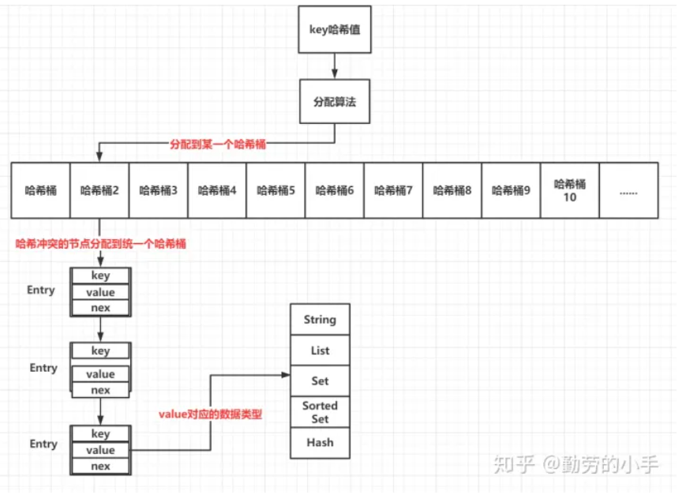
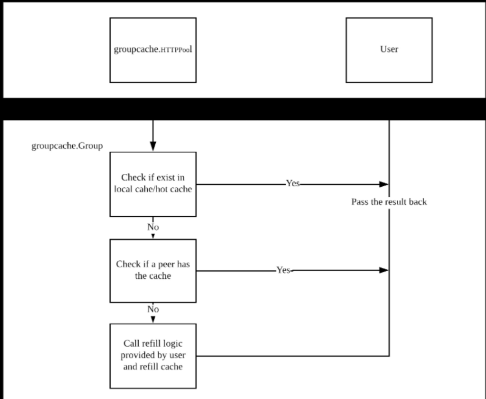

## 缓存 ##

缓存,是数据交换的缓冲区(又称作Cache),缓存的目的是复用计算资源、缓解IO压力、缓解网络压力。

一般而言，变动频率大、一致性要求高的数据，不适合用缓存，因为变化频率大，意味着内存缓存数据与原始数据库数据一直有差异，而一致性要求高，意味着只有使用原始数据、甚至加了事务才最保险。

**缓存有效性** ：
- 读写比 ：对数据的写操作导致数据变动，意味着维护成本
- 命中率 ：命中缓存意味着缓存数据被使用，意味着有价值

**缓存策略** ：缓存的设置需要考虑容量和过期策略
- 资源有限，因此容量是必须要考虑的问题
- 缓存过期策略有FIFO策略、LRU 策略（常用，但存在热点数据问题）、LFU策略（解决了热点数据问题，但需要为每个缓存key维护一个计数器，需要大量的内存资源）、TinyLFU策略、W-TinyLFU策略

**缓存常见问题** ：
- 缓存击穿 ：某个缓存失效的时候，正好有大量并发请求访问这个数据进入到数据库，数据库因为承受不了大量的请求而崩溃。
- 缓存穿透 ：大量并发查询系统不存在的数据，导致请求总是无法命中缓存，直接将压力透传到数据库。
- 缓存雪崩 ；缓存在同一时刻全部失效，造成瞬时数据库请求量大、压力骤增，引起雪崩。常因为缓存服务器宕机或缓存设置了相同的过期时间引起。

**解决办法** ：
- 缓存击穿 ：1、加锁，当查询请求未命中缓存时，查询数据库操作前进行加锁，加锁后后面的请求就会阻塞，避免大量的请求集中进入到数据库查询数据；2.不设置过期时间
- 缓存穿透 ：1、缓存null值，如果数据不存在的情况下，缓存一个对应key的null值，当请求下次进来的时候发现缓存对应的null就直接返回结果；2、布隆过滤器：不保存实际数据，而是在内存中创建一个一定长度的位图来用0和1来标记对应的数据是否存在系统；3、完全以缓存为准，使用延迟异步加载的策略，这样就不会触发更新。
- 缓存雪崩 ：1、缓存的可靠性保障：更新策略在时间上做到比较均匀、缓存分片（哈希算法、一致性哈希算法）、缓存热备选主（redis哨兵机制，通过sentinel来监控每个redis节点的状态，若监测到节点失效，从备选节点里面选举出一个新的主节点来对外提供服务）；2、系统的可用性保障（限流、熔断、降级）

> REmote DIctionary Server(Redis)，是一个开源的使用ANSIC语言编写、遵守BSD协议、支持网络、可基于内存亦可持久化的日志型、Key-Value数据库，并提供多种语言的API。

**选择缓存需考虑的方面** ：
- 吞吐量问题
- 缓存命中率问题
- 缓存扩展功能
- 缓存共享问题

## 分布式缓存 ##

分布式缓存市一种支持多进程共享、数据持久化、技术异构的缓存。
常见分布式缓存对比如下。

|    比较    |             Redis              |           memcached           |
|:--------:|:------------------------------:|:-----------------------------:|
|   线程模型   |             单进程单线程             |            单进程多线程             |
| QPS/TPS  |           10W+/<10W            |           10W+/10W+           | 
|  数据支持类型  | key-value、set、map、list、string等 |           key-value           |
|  持久化支持   |               支持               |              不支持              |
|   能否集群   |               能                |               能               |
|  支持数据备份  |               支持               |              不支持              |
|  数据一致性   |              支持事务              |           轻量级锁CAS机制           |
| List排序支持 |               支持               |              不支持              |
|  缓存淘汰策略  |       配置范围：LRU、FIFO、LFU        |              LRU              |
| Jcache支持 |               支持               |              支持               |
|  单条数据约束  |         不同数据结构有不同的约束规则         | 默认值：key最大长度250个字符，value容量<=1M |

**一致性哈希算法** ：

**缓存一致性问题** ：主要原因是在并发情况下，修改缓存数据获数据库数据时，数据库和缓存之间的同步问题从而导致缓存数据与数据库的数据不一致。

解决方案：
1. Cache Aside（旁路缓存） ：修改数据时，先修改数据库、然后不对缓存进行修改而是直接删除缓存；读取数据时，先从缓存读取、如果缓存没有则从数据库读取数据，最后把读取到的数据保存到缓存。
2. Read/Write Through策略 ：以缓存为主，用户对数据的读取和变更都只操作缓存，由缓存负责把变更同步给下游的持久化服务。
3. Write Back（回写策略） ：该策略应用的代表是CPU缓存，主要目的是为了解决写入性能瓶颈问题，通过把多次写入操作合并，达到性能优化的目的。
4. 更新缓存时加锁 ：避免了并发修改数据的可能，从而避免了缓存不一致问题
5. 设置较短的过期时间 ：通过设置过期时间来避免不一致的数据一直被错误的使用，这种方式虽然不是直接解决了缓存不一致性的问题，但是可以控制不一致数据存在的时长。

### Redis ###
**索引**：索引会决定一个数据是如何进行存储和检索的，常用的索引结构有哈希表（适合键值对的存储结构、精确查找快）、
B+树（适合磁盘数据的检索，适合排序、范围查找）、字典树（适合做字符串模糊匹配），不同的索引结构有不同的特性，
**redis使用的索引结构为哈希表**

redis的key定位过程主要有两部分：
1. 计算key哈希值
2. 经过算法吧key保存到对应哈希桶

- **哈希冲突的问题解决** ： 因为哈希桶的数量是有限的，不可避免的会出现哈希冲突，出现哈希冲突的元素会保存到同一个哈希桶中，这时哈希桶里的元素会以链表的形式保存。

- **rehash操作** ：当哈希冲突越来越多，链表的长度会影响到redis操作的性能，那么这个时候就需要创建一个长度更大的哈希桶列表来保存元素了，这个时候会进行rehash的操作，其过程就是创建一个新的哈希桶，然后把旧的哈希桶值迁移到新的哈希桶里去。

- **rehash阻塞问题** ：在进行rehash的时候需要把原哈希桶的列表拷贝到新的哈希桶列表里去，这个过程是非常耗时的，为了避免这个过程降低redis的性能，所以redis是采用渐进式的rehash，每当redis收到一个指令就会进行一个哈希桶的数据拷贝，直至所有的哈希桶都进行拷贝完成，新的哈希桶才对外提供访问。

**线程模型** ：redis线程模型是单线程模型（redis进行网络IO和数据读写的操作是一个线程完成，其它地方还是开启的多线程工作的），选择该模式的主要原因可以分析为线程模型的程序设计和编写简单，一方面多线程涉及到并发问题，常见并发问题会使用互斥锁解决，然而锁的开销也会影响性能；
另一方面，redis是基于内存的数据操作，总体来说IO的阻塞时间相比磁盘磁盘IO要短得多，所以因为IO速度快、然后除去多线程本身线程切换的开销，可能单线程和多线程的性能差距不会相差特别大。（Redis 6.0 版本引入了多线程分摊 Redis 同步 IO 读写负荷）

redis单线程的速度这么快的原因：
1. 内存数据库：Redis的操作是基于内存的，在内存上进行IO的速度非常快。
2. 索引机制：Redis是使用哈希表作为索引的，哈希表的特点就是精确查找快，Redis基于key value的存储形式，只需要根据key的哈希值一次就可以找到key对应的数据。
3. IO模型：Redis是基多路复用模型中的epoll模型进行网络通讯的，epoll模型只需要一个线程就可以监听多个连接，epoll模型的事件监听机制，所有的数据都是异步操作，也不会阻塞主线程。

单线程带来的性能瓶颈：单个请求的耗时长会影响其他的请求响应，因为是单线程处理的读写请求，那么一个请求处理的时间长短会直接影响到后面的请求，影响单个请求时长的操作会有很多，比如下面几种
1. bigkey ：单个key的数据越大那么数据的读取、修改、删除、网络传输都会比比较耗时。 
2. 单次读取的数据大 ：单次读取数据越大那么IO和网络传输的时间也会越长。 
3. 复杂的命令和检索 ： 越是复杂的命令处理的速度自然也会越慢，比如复杂度比较高的数据查找，范围扫描的数据过多。 
4. 大量key集中过期和淘汰 ：key过期和淘汰的时候是需要主线程去处理的，数据越大那么处理的时间也就越长。 
5. RDB生成 ：生成RDB的时候需要主进程fork一个子进程来进行，子进程是异步的，但是fork子进程的过程是同步的，数据量越大那么fork子进程消耗的时间就越长。

**数据的可靠性保障（RDB、AOF）** ：Redis作为一个存储型的中间件，数据的可靠性是必须考虑的一件事，既然是存储型的程序那么就必须做好数据的保障工作，
如何保证数据不丢失。存储型的程序保障数据的可靠性一般都是基于快照副本和日志两种手段来实现，redis也不例外，基于RDB机制的快照，和AOF的日志就是实现数据可靠性保证的关键。
- RDB是以快照的形式来保证数据的可靠性的，对某一个时间点的全量数据持久化到磁盘保证数据不丢失，如果Redis宕机了就可以读取RDB文件来恢复数据，在进行快照的时候会有两个问题需要考虑。
1. 进行快照不能影响主进程 ：Redis是通过fork一个子进程来进行快照，在进行RDB快照的时候主进程是不参与的，除了fork子进程需要阻塞主进程，后面备份的工作就交给子进程去处理了
2. 数据时间点的问题 ：Copy on write 机制
- AOF是一种实时的数据变更日志记录（Mysql的binlog），AOF日志是在命令执行之后再进行写入的，这种方式避免了写日志的语法检查和阻塞，但是如果刚好执行完指令宕机那么还是会有指令级数据丢失的风险。——Always（同步回写）: 执行完指令后必须同步写完日志后请求才响应；Everysec（定时回写）： 异步回写，执行完指令后先把日志记录到内存缓冲区里面，然后每隔一段时间把缓冲区刷到日志记录里；No（系统触发回写）: 异步回写，执行完指令后先把日志记录到内存缓冲区里面，由系统决定什么时候把缓冲数据刷到日志里。

**主从同步机制** ：Redis为了保证系统可用性，采用主从模式，一台主主节点向外提供读写服务，从节点同步主节点的数据信息，一旦主节点故障那么就可以把一个从节点变为主节点向外提供服务，以这种方式来保证服务的可用性。
主从模式核心问题是主节点和从节点之间的数据同步的机制，Redis的主从数据同步主要分为两个阶段，初始化数据同步和更新数据同步，初始化数据同步主要是通过RDB完成，更新数据同步通过replication buffer来完成，主要流程如下
1. 从库向主库发起同步请求（psync）
2. 主库把RDB文件发送给从服务
3. 主库把replication buffer里面的指令发送给从节点，从节点在RDB数据同步完后，开始并执行来自主服务器缓冲区的写命令

redis主从一致问题：主库添加删除缓存信息同步到从库

redis高可用：利用sentinel监控主从节点，当主库挂了之后，sentinel从redis从库中选出一个作为主库

程序联调：spring boot整合sentinel后可正常操作缓存，原master节点切换之后可以重新来凝结到新选上来的master节点

## groupcache ##
groupcache是一个key/value键值存储项目，是一个轻量级的分布式缓存库。与Redis等其他常用的cache实现不同，groupcache并不运行在单独的服务器中，而是作为library和应用运行在同一进程中，既是客户端优势服务器。
**特点** ：
- 不提供update/delete/TTL等常见操作，其唯一更改缓存的方式是refill(缓存一旦写入便无法更新)——应用场景有限
- 轻量，一共3000+行代码，只依赖标准库，所以逻辑很清晰
- 
- 
**基本过程** ：
1. 获取本地缓存和热点缓存
2. 在本地没有获取到缓存情况下，使用一致性哈希算法，从远端peer获取数据，同时本地会生成热点数据
3. 在远端peer没有获取到缓存情况下，从数据库（mysql、文件等）中获取数据
4. 在2、3步骤中，groupcache有自己的并发控制器，当对于同一个key的多个请求，保证只有一个请求能从远端和数据源中获取或更新缓存，这个请求取到数据后统一返回，一定程度上减少不必要的网络请求和缓存击穿
5. 从数据源获取的数据设置到本地缓存

## geecache ##
**geecache**参考了groupcache的实现，裁剪了部分功能，支持的特性有：
- 单机缓存和基于HTTP的分布式缓存
- 最近最少访问（Least Recently Used，LRU）缓存策略
- 使用Go缓存锁机制防止缓存击穿
- 使用一致性哈希算法选择节点，实现负载均衡
- 使用protobuf优化节点间二进制通信

各个模块设计具体如下。
