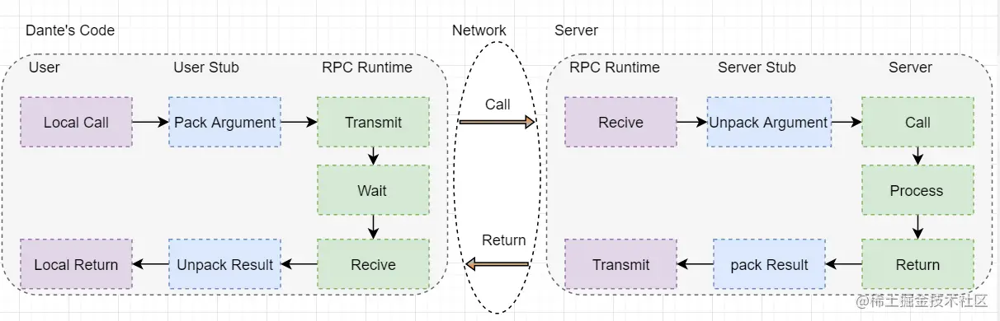

# 分布式系统通信简介

分布式系统有三种类型的通信机制
- 进程间的通信
- 远程调用
- 间接通信

## 进程间通信
进程使用相对底层的API接口执行数据的传输，较少采取分层的协议，倾向于采取简单的模式。

## 远程过程调用
远程过程调用是分布式系统中最常见的通信机制  
远程过程调用是一种通信协议，一个程序可以调用网络上另一台计算机中的程序，而无需了解网络的详细信息

RPC 是一种**同步**操作，需要暂停请求程序，直到返回远程过程的结果

## 间接通信
间接通信被定义为在分布式系统中实体通过中介者进行通信，没有发送者和接收者之间的直接耦合
1. 组通信： 组通信是对组播通信的抽象，可以通过IP组播或者一个等价的覆盖网络实现，发送者不知道接收者的身份。 
2. 发布-订阅系统：发布方通过中介者将事件分发给多个接收者。 
3. 消息队列系统：发送方将消息发送到队列中，接收者从这些队列中提取消息。一般的消息中间件都会支持两种模式的队列，即发布-订阅系统和消息队列
4. 基于共享内存的方法：包括分布式分享内存和元组空间两种方法，给编程人员提供一个抽象的全局共享内存抽象。
