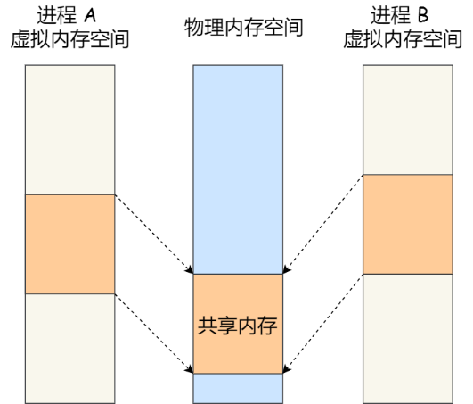

# 进程

## 进程的基础概念

进程是进程实体的运行过程，是系统进行资源分配和调度的一个独立单位。
进程实体包括了：
- 程序段（代码）
- 相关数据段（全局变量、堆栈、虚拟地址、文件描述符等）
- 进程控制块（PCB，描述进程的基本情况和运行态，是进程存在的唯一标识，被系统用来控制和管理进程的方式）

> 引入进程的概念是为了更好地描述和控制程序的并发执行，实现操作系统的并发性和共享性。

进程的特征包括动态性，并发性（多个进程并发执行），独立性（独立运行，独立获得资源和接受调度的基本单位），异步性（执行的间断性），结构性（进程控制块PCB）。

其中，动态性是进程的基本特征，主要指进程是程序的一次执行，它具有一定地生命周期，从产生到结束有不同的状态（其中就绪态、运行态、阻塞态为进程的基本状态）:
1. 创建态 ：申请一个空白PCB，并向PCB写入控制管理进程的信息，系统位该进程分配运行时所必要的资源，然后将它移入就绪态；
2. 就绪态 ：进程处于准备运行的状态，此时进程拥有除CPU外的一些所需资源，一旦得到CPU即可运行；
3. 运行态 ：CPU正在运行该进程，每个时刻一个CPU只能运行一个进程（因为CPU每次只可以运行一条指令）；
4. 阻塞态 ：进程正在等待某一事件而暂停，如等待某资源可用或者等待输入输出完成。即使CPU空闲，该进程也不能被执行。进程的阻塞是进程自身的主动行为，执行**阻塞原语Block**。唤醒时由提供数据/资源的进程执行**唤醒原语Wakeup**。
5. 结束态 ：进程正在从系统消失，可能是正常退出或者异常中断，系统首先置该进程为结束态，再进一步处理资源的释放和回收。

任何进程都是在操作系统内核的支持下运行的，是与内核紧密相关的（比如进程的创建、撤销、要求系统设备完成的I/O操作以及进程的切换）。

## 进程通信

进程通信是指进程之间的信息交换，每个进程的用户地址空间都是独立的，一般而言是不能互相访问的，但内核空间是每个进程共享的，所以进程之间通信必须要通过内核。
进程通信的方式有：共享存储、消息队列、管道、信号、Socket。

**管道通信** ：管道指用于连接一个读进程和写进程以实现它们之间的通信的一个共享文件，称为pipe文件，它是内核中的一个缓冲区，有一个写文件描述符（往里写）和一个读文件描述符（读取数据）。
管道是一个特殊的文件，只存在于内存中，只要进程拥有该文件描述符，就可以对管道进行操作。管道是一个**同步**通信操作。

管道分为匿名管道和命名管道：
- 匿名管道通过fork来传递父进程的文件描述符，Fork回复制父进程的所有资源，它的通信范围是存在父子关系的进程，管道中的数据只能单向流动(如果想实现相互通信（全双工通信），需要创建两个管道)。
- 命名管道在不相干的进程间也能相互通信，因为命名管道提前创建了一个类型为管道的设备文件，在进程里只要使用这个设备文件，就可以相互通信。

管道机制必须提供互斥、同步和确定对方存在的能力以确保双方的通信。管道采用半双工通信，某一时刻只能单向传输。管道遵循先进先出原则，并且大小受限。管道虽然使用简单，但是效率比较低，不适合进程间频繁地交换数据，并且管道只能传输无格式的字节流。

**消息传递** ：进程通过系统提供的发送信息和接收信息两个原语进行数据交换，分为直接通信和间接通信两种方式。消息传递是一个**异步**通信操作，可以实现消息的随机查询（比管道的先进先出原则更有优势）。
- 直接通信即利用保存在内核的消息队列（消息链表）进行通信，在发送数据时，会分成一个一个独立的数据单元，也就是消息体（数据块），消息体是用户自定义的数据类型，消息的发送方和接收方要约定好消息体的数据类型，所以每个消息体都是固定大小的存储块，*不像管道是无格式的字节流数据*。如果进程从消息队列中读取了消息体，内核就会把这个消息体删除。
- 间接通信又指信箱通信，发送进程把消息发送到某个中间实体（信箱），接收进程从中间实体取得消息。信箱通信方式存在不足的地方有两点，一是通信不及时，二是附件也有大小限制。内核中每个消息体都有一个最大长度的限制，同时所有队列所包含的全部消息体的总长度也是有上限。

> 消息队列通信过程中，存在用户态与内核态之间的数据拷贝开销，因为进程写入数据到内核中的消息队列时，会发生从用户态拷贝数据到内核态的过程，
> 同理另一进程读取内核中的消息数据时，会发生从内核态拷贝数据到用户态的过程。共享内存不会，共享内存直接就把内容写进去了。

如果数据量较大，使用消息队列就会造成频繁的系统调用，也就是需要消耗更多的时间以便内核介入。

**共享存储** ：分为基于内存空间的共享，共享内存的机制，就是拿出一块虚拟地址空间来，映射到相同的物理内存中。

> 这样进程写入的东西，另外一个进程马上就能看到了，都不需要拷贝来拷贝去，大大提高了进程间通信的速度。

多个进程同时修改同一个共享内存，有可能会造成冲突。例如两个进程都同时写一个地址，那先写的那个进程会发现内容被别人覆盖了。
因此需要同步互斥工具对共享内存的读/写进行控制，保证在任意时刻只能被一个进程访问，信号量实现了这一机制。

信号量是一个整型的计数器，表示资源的数量，主要用于实现进程间的互斥与同步，而不是用于缓存进程间通信的数据。
控制信号量的方式有两种原子操作：
- P 操作 ：这个操作会把信号量减去 -1，相减后如果信号量 < 0，则表明资源已被占用，进程需阻塞等待；相减后如果信号量 >= 0，则表明还有资源可使用，进程可正常继续执行。（先减去一再判断）
- V 操作 ：这个操作会把信号量加上 1，相加后如果信号量 <= 0，则表明当前有阻塞中的进程，于是会将该进程唤醒运行；相加后如果信号量 > 0，则表明当前没有阻塞中的进程。
  P 操作是用在进入共享资源之前，V 操作是用在离开共享资源之后，这两个操作是必须*成对*出现的。

可以发现，信号初始化为 1，就代表着是**互斥信号量**，它可以保证共享内存在任何时刻只有一个进程在访问，这就很好的保护了共享内存。信号初始化为 0，就代表着是**同步信号量**，它可以保证进程 A 应在进程 B 之前执行。

> 同步信号量类似于Go里面无缓冲的Channel

操作系统只负责为通信进程提供可共享存储空间和同步互斥工具。

**信号** ：信号是在异常情况下进程间的通信方式，它与信号量的用途完全不一样。信号是进程间通信机制中的异步通信机制，因为可以在任何时候发送信号给某一进程，一旦有信号产生，进程便会对其进行处理，主要处理方式有：
1. 执行默认操作
2. 捕捉信号，我们可以为信号定义一个信号处理函数。当信号发生时，我们就执行相应的信号处理函数（参照网络IO模型中的信号模型）。
3. 忽略信号，当我们不希望处理某些信号的时候，就可以忽略该信号，不做任何处理。有两个信号是应用进程无法捕捉和忽略的，即 SIGKILL 和 SEGSTOP，它们用于在任何时候中断或结束某一进程。

信号事件的来源主要有硬件来源（如键盘Ctrl+C）和软件来源（如kill命令）。

> 通过 kill -l 命令，可以查看所有的信号；键盘Ctrl+C 表示产生 SIGINT 信号，表示终止该进程等等。
> 可以通过 kill 命令的方式给进程发送信号，但前提需要知道运行中的进程 PID 号，
> 例如：kill -9 1050 ，表示给 PID 为 1050 的进程发送 SIGKILL 信号，用来立即结束该进程。

**Socket** ：套接字，可以跨网络与不同主机上的进程进行通信（也可以通过端口完成同主机上的进程通信），它是计算机之间进行通信的一种约定或者方式。Socket是对TCP/IP协议的封装，所以Socket通信可以传输字节流和数据包。

## 进程的互斥、同步

进程之间存在两种基本关系：竞争关系和协作关系。 进程的互斥、同步、通信都是基于这两种基本关系而存在的，为了解决进程间竞争关系（间接制约关系）而引入进程互斥；为了解决进程间松散的协作关系( 直接制约关系)而引入进程同步；为了解决进程间紧密的协作关系而引入进程通信。

**进程同步** ：进程之间需要保持它们的工作次序（制约关系）所采用的方法。常用的方法有：信号量机制，将初始值信号量设为0。

**进程互斥** ：只有一个进程可以访问临界资源，其他的进程必须等待。常用方法有：信号量、互斥锁（原语）、管程。
1. 互斥锁 ：分为忙等待锁和非忙等待锁。
忙等待锁又称**自旋锁**， 进程会一直自旋（while 循环访问锁解了没），利用 CPU 周期，直到锁可用（因为一个自旋的线程永远不会放弃 CPU）。 
非忙等待锁当没获取到锁的时候，就把当前线程放入到锁的等待队列，然后执行调度程序，把 CPU 让给其他线程执行，其中涉及进程的切换。

> 忙等待锁适合进程使用临界资源特别频繁，快速的时候，因为忙等的开销比进程切换的开销要少。而非忙等锁适合进程大的临界资源长时间使用的场景（比如打开文件）。

2. **管程** ：管程是一个模块，由关于共享资源的数据结构和在其上操作的一系列过程组成。 进程只能通过调用管程的过程来间接访问管程中的数据结构。管程是互斥的。

> 经典同步问题（用来建模的) ：比如哲学家进餐问题对互斥访问有限I/O设备一类建模过程十分有用，读者写者问题对数据库访问建立了一个模型。

> 读者-写者的问题描述 ：「读-读」允许：同一时刻，允许多个读者同时读 ；「读-写」互斥：没有写者时读者才能读，没有读者时写者才能写 ；「写-写」互斥：没有其他写者时，写者才能写。

> 解决方案：读者优先策略，写者优先策略和读写锁。读写锁防止了读者/写者无限进临界区而写者/读者进不去的场景。通过维护一个变量flag，当开始来了一些读者读数据，它们全部进入读者队列，此时来了一个写者，执行 P(falg) 操作，使得后续到来的读者都阻塞在 flag 上，不能进入读者队列，这会使得读者队列逐渐为空。 这个写者也不能立马开始写（因为此时读者队列不为空），会阻塞在信号量上，读者队列中的读者全部读取结束后，最后一个读者进程执行 V(wDataMutex)，唤醒刚才的写者，写者则继续开始进行写操作。

# 线程

## 线程的基本概念
引入线程的目的是减少程序在并发执行时所付出的时空开销，提高操作系统的并发性能。线程是进程中的一个实体（”轻量级进程“），是被系统独立调度执行的最小单位。
线程自己不拥有系统资源，只拥有一点在运行中必不可少的资源，但是它与其他同在一个进程中的线程共享进程的所有资源（不包括线程自己的独立资源）。
线程由线程ID，程序计数器，寄存器集合和堆栈组成（创建时为几十KB）。线程之间相互制约，执行中有间断性，有就绪、阻塞、运行三种状态，有生命周期。

## 进程与线程的区别
进程与线程的区别可以包括几部分，包括：
1. 调度 ：进程是资源分配（除CPU外）的最小单位，线程是CPU调度的最小单位。
2. 拥有资源 ：进程拥有代码段、数据段、堆栈等等，而线程所占用的资源很少（十几个寄存器和独有的栈放局部变量和临时变量）
3. 并发性 ：进程和线程有并发性
4. 系统开销 ：进程创建或撤销时需要操作系统为之分配和回收资源，因此操作系统所付出的开销远远大于线程创建或撤销的开销。类似的，在进行切换时，线程只需要保存很少的上下文信息。同时由于进程共享地址空间，所以同步和通信也非常方便。
5. 地址空间与资源 ：进程之间地址空间互相独立，同一进程的各线程共享进程的资源，不同进程的线程之间不可见
6. 通信 ：进程间通信（IPC）需要进入内核态，但线程有时候只需要读/写全局变量来通信

## 线程通信
由于多线程共享地址空间和数据空间，所以多个线程间的通信是一个线程的数据可以直接提供给其他线程使用，而不必通过操作系统（也就是内核的调度）。
但要做好同步/互斥, 保护共享的全局变量。Go里用消息队列来实现线程通信（Channel）。
*线程的通信主要用于线程的同步*。所以不需要像进程中大数据的传输机制（Go的channel反而鼓励以消息传递来代替共享）。
线程同步主要方法有互斥锁、信号量、读写锁。

## 多线程模型
线程的实现可以分为两类：用户级线程和内核级线程。在用户级线程中，有关线程管理的工作都由应用程序完成，内核意识不到线程的存在。在内核级线程中，线程管理的工作由内核完成。
有些系统同时支持用户线程和内核线程，即多线程模型，是西安用户级线程和内核级线程的连接方式。
# 协程