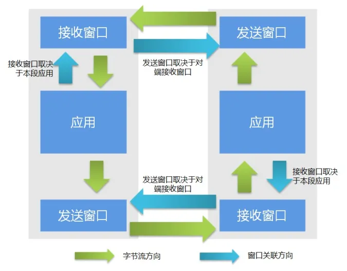

# TCP 滑动窗口机制
滑动窗口是传输层进行流量控制的一种措施，接收方通过告诉发送方自己的窗口大小，从而控制发送方的发送速度（本质上是控制发送方的发送窗口大小），从而达到防止发送方发送速度过快而导致自己被淹没的目的。

## 滑动窗口
**滑动窗口**代表在底层无序的字节流中，以窗口边界确定可以**发送/接收**的字节。

如图，即使缓冲区有足够多的可用字节，但是只有在窗口内的字节才会被发送。  

TCP滑动窗口分为发送窗口和接收端口，每个端都必须具备这两个窗口（因为TCP是全双工通信）。
- 发送窗口：当前可以发送的字节，与接收方的接收窗口大小相同。
- 接收窗口：当前可以接收的字节，取决于应用、系统、硬件的限制。

接受窗口的第一个字节序之前一定是已经完全接收的，窗口里面的字节都是希望接受的，窗口外的字节都是不希望接受的。  
只有窗口第一个字节收到后，窗口才会往后移。

## 

