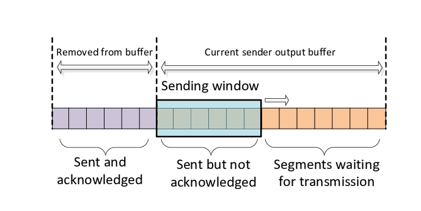

# TCP 滑动窗口机制
滑动窗口是传输层进行流量控制的一种措施，接收方通过告诉发送方自己的窗口大小，从而控制发送方的发送速度（本质上是控制发送方的发送窗口大小），从而达到防止发送方发送速度过快而导致自己被淹没的目的。

## 滑动窗口
**滑动窗口**代表在底层无序的字节流中，以窗口边界确定可以**发送/接收**的字节。

如图，即使缓冲区有足够多的可用字节，但是只有在窗口内的字节才会被发送。  

TCP滑动窗口分为发送窗口和接收端口，每个端都必须具备这两个窗口（因为TCP是全双工通信）。
- 发送窗口：当前可以发送的字节，与接收方的接收窗口大小相同。
- 接收窗口：当前可以接收的字节，取决于应用、系统、硬件的限制。

接受窗口的第一个字节序之前一定是已经完全接收的，窗口里面的字节都是希望接受的，窗口外的字节都是不希望接受的。  
只有窗口第一个字节收到后，窗口才会往后移。

### 实现面向流的可靠性
1. 最基本的传输可靠性来源于**确认重传**机制。 
2. 发送窗口只有收到接收方对于发送窗口内字节的ACK确认，才会移动发送窗口的左边界。 
3. 接收窗口只有在前面所有的段都确认的情况下才会移动左边界。
4. 当在前面还有字节未接收但收到后面字节的情况下，窗口不会移动，并不对后续字节发送ACK确认。以此确保发送方会对这些数据重传

### 流控特性
应用根据自身的处理能力变化，通过本端TCP接收窗口大小控制来发送方的发送窗口从而达到流量限制。  
1. 应用程序在需要控制发送速率（如内存不足）时，通过API通知TCP协议栈缩小TCP的接收窗口。
2. TCP协议栈在下个报文段发送时的首部中包含新的窗口大小通知给发送方。
3. 发送方按通知的窗口来改变发送窗口，以此达到减缓发送速率的目的。