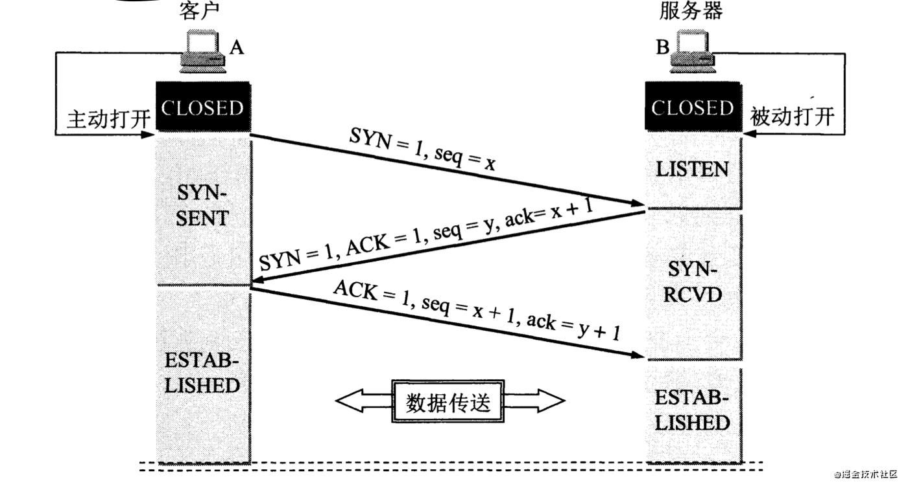
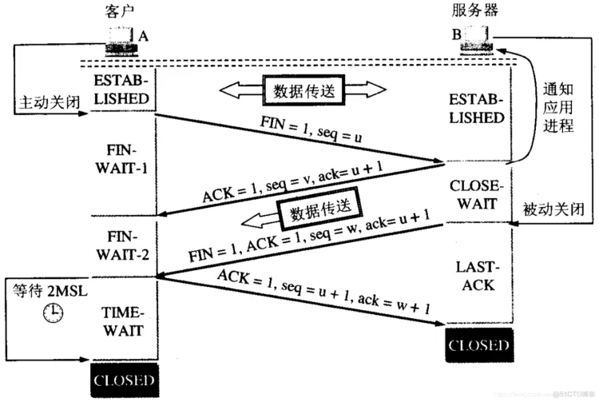

# TCP的状态与连接

## TCP连接建立

连接建立时，双方所交互的信息有
- 双方数据流发送的序号和确认号
- 双方的接收窗口的大小
- 协商MSS

TCP规定，ACK报文段可以携带数据

服务端的资源是在第二次握手时分配的（因为客户端第三次握手可能会发送数据），而客户端的资源是在完成第三次握手时分配的，这使得服务器容易受到SYN洪水攻击

---

## TCP连接关闭

客户端为什么要等待2MSL
1. 保证客户端发送的最后一个ACK报文能够到达服务器。站在服务器的角度，我已经发送了FIN+ACK报文请求断开了，客户端还没有给我回应，应该是我发送的请求断开报文它没有收到，于是服务器又会重新发送一次，而客户端就能在这个2MSL时间段内收到这个重传的报文，接着给出回应报文，并且会重启2MSL计时器。如果客户端收到服务端的FIN+ACK报文后，发送一个ACK给服务端之后就“自私”地立马进入CLOSED状态，可能会导致服务端无法确认收到最后的ACK指令，也就无法进入CLOSED状态，这是客户端不负责任的表现。
2. 防止失效请求。客户端发送完最后一个确认报文后，在这个2MSL时间中，就可以使本连接持续的时间内所产生的所有报文段都从网络中消失。这样新的连接中不会出现旧连接的请求报文

--- 

## TCP状态
### LISTEN
表示监听一个来自于远程TCP和端口的连接请求

### SYN-SENT
表示在发送连接请求后，等待一个匹配的连接请求

### SYN-RECEIVED
表示在发送连接请求和匹配请求后，等待一个确认连接建立请求

### ESTABLISHED
表示一个打开的连接，数据可以正常发送。是在连接中传输数据的主要阶段

### FIN-WAIT-1
表示等待远程TCP连接关闭的请求，或者是表示该方之前发送过连接中断的请求

### FIN-WAIT-2
表示等待远程TCP连接关闭的请求

### CLOSE-WAIT
表示等待本地用户的连接关闭的请求

### CLOSING
表示等待一个由远程TCP确认的连接关闭请求

### LAST-ACK
表示等待之前发送给远程TCP的连接关闭请求已经被确认的请求

### TIME-WAIT
表示等待足够的时间去让远程TCP收到连接关闭请求的确认

### CLOSED
表示连接状态全部终止