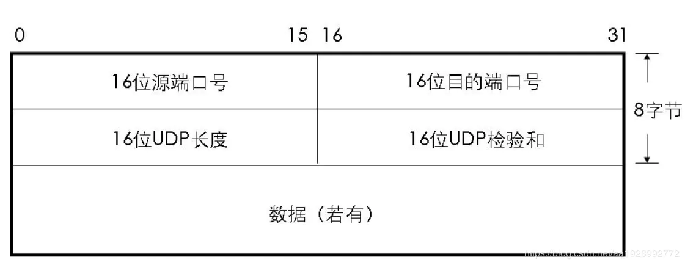

# UDP 首部

UDP协议的首部很简单

UDP报头包括4个字段，每个字段占用2个字节（即16个二进制位）。
首部剩下地16bit是用来对首部和数据部分一起做校验和（Checksum）的，这部分是可选的，但在实际应用中一般都使用这一功能

### 源端口
代表发送的应用进程，是一个可选字段。因为UDP不需要应答，所以来源端口是可选的。如果来源端口不用，那么置为零

### 目的端口
代表接收的应用进程。

### 报文长度
该字段指定UDP报头和数据总共占用的长度。  
可能的最小长度是8字节，因为UDP报头已经占用了8字节。由于这个字段的存在，UDP报文总长不可能超过65535字节（包括8字节的报头，和65527字节的数据）。  

**实际上**：最大安全UDP有效数据为 508 字节。这是一个 576 的数据包大小（“以太网的最小MTU/最小最大重组缓冲区大小”，大于这个MTU的可能会被分片），减去最大 60 字节 IP 标头和 8 字节 UDP 标头。  

安全大小的数据包可以在单个以太网帧中发送而不会被分段。任何片段的丢失都将导致整个数据包无用。因此，当超过此限制时，由于碎片和单个碎片的潜在丢失，传输失败的机率会增加。

### 校验和
校验和字段可以用于发现头部信息和数据中的传输错误。该字段在IPv4中是可选的，在IPv6中则是强制的。如果不使用校验和，该字段应被填充为全0