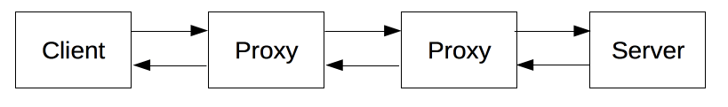
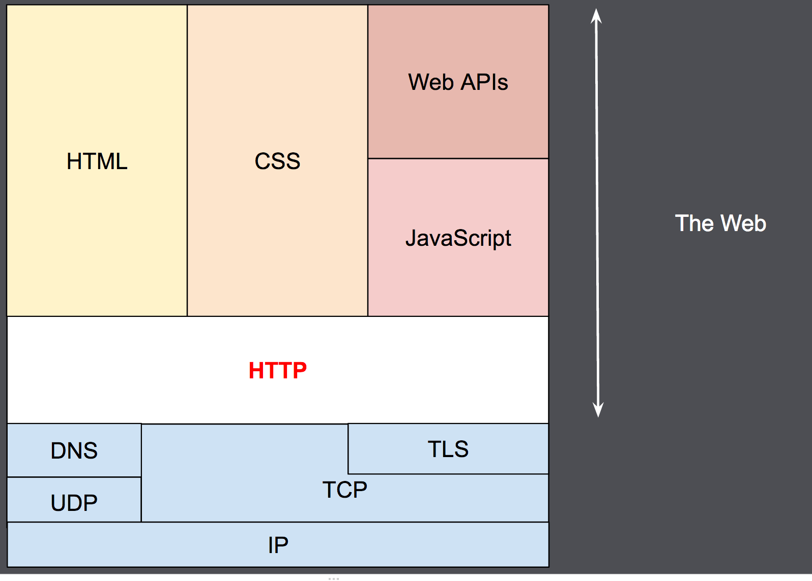

# HTTP 介绍
超文本传输协议（HTTP）是一个用于传输超媒体文档（例如 HTML）的应用层协议。它是为 Web 浏览器与 Web 服务器之间的通信而设计的，但也可以用于其他目的

HTTP是一个客户端（用户）和服务端（网站）之间请求和应答的标准，通常使用TCP协议。

HTTP协议中并没有规定它必须使用或它支持的层。HTTP可以在任何互联网协议或其他网络上实现。HTTP假定其下层协议提供可靠的传输。

## 特点
- HTTP 遵循经典的客户端-服务端模型，客户端打开一个连接以发出请求，然后等待直到收到服务器端响应。
- HTTP 是无状态协议，这意味着服务器不会在两个请求之间保留任何数据（状态）。HTTP Cookies 就可以解决这个问题。把 Cookies 添加到头部中，创建一个会话让每次请求都能共享相同的上下文信息，达成相同的状态。
> 注意，HTTP 本质是无状态的，使用 Cookies 可以创建有状态的会话
- HTTP 是可扩展的, HTTP headers 让协议扩展变得非常容易。只要服务端和客户端就新 headers 达成语义一致，新功能就可以被轻松加入进来

## 概述
### 请求与响应
客户端和服务端通过交换各自的消息进行交互。由像浏览器这样的客户端发出的消息叫做 request，被服务端响应的消息叫做 response

在这个请求与响应之间，还有许许多多的被称为 proxies 的实体，他们的作用与表现各不相同，比如有些是网关，还有些是caches等

因为其良好的扩展性，时至今日，它不仅被用来传输超文本文档，还用来传输图片、视频或者向服务器发送如 HTML 表单这样的信息

### 一个网页的形成
浏览器要展现一个网页，浏览器首先发送一个请求来获取页面的 HTML 文档，再解析文档中的资源信息发送其他请求，获取可执行脚本或 CSS 样式来进行页面布局渲染，以及一些其它页面资源（如图片和视频等）。然后，浏览器将这些资源整合到一起，展现出一个完整的文档，也就是网页。浏览器执行的脚本可以在之后的阶段获取更多资源，并相应地更新网页。

### 客户端
客户端就是任何能够为用户发起行为的工具，通常都是由浏览器来扮演。

### 服务端
Web Server 服务并提供客户端所请求的文档。Server 只是虚拟意义上代表一个机器：它可以是负载均衡的一组服务器组成的计算机集群，也可以是一个软件程序，通过向其他计算机（如缓存，数据库服务器，电子商务服务器 ...）发起请求来获取部分或全部资源。

### 代理（Proxies）
在浏览器和服务器之间，有许多计算机和设备转发了 HTTP 消息。由于网络层次结构的原因，它们大多都出现在传输层、网络层和物理层上，对于 HTTP 应用层而言就是透明。还有一部分是表现在应用层上的，被称为代理（Proxies）。代理（Proxies）既可以表现得透明，又可以不透明。代理主要有如下几种作用：

- 缓存（可以是公开的也可以是私有的，像浏览器的缓存） 
- 过滤（风控，家长控制...） 
- 负载均衡（让多个服务器服务不同的请求） 
- 认证（对不同资源进行权限管理） 
- 日志记录（允许存储历史信息）
