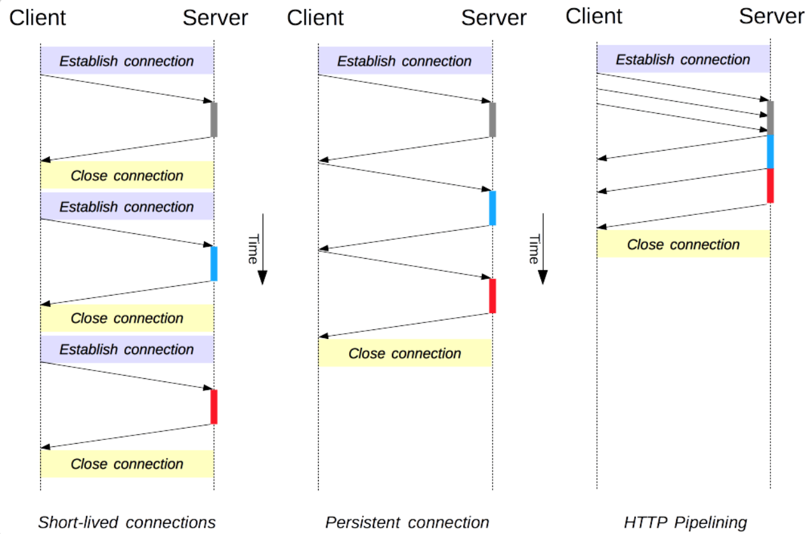

# HTTP 底层连接

### 依赖的传输层
一个连接是由传输层来控制的，这从根本上不属于 HTTP 的范围。 HTTP 并不需要其底层的传输层协议是面向连接的，只需要它是可靠的，或不丢失消息的（至少返回错误）。在互联网中，有两个最常用的传输层协议：TCP 是可靠的，而 UDP 不是。因此，HTTP 依赖于面向连接的 TCP 进行消息传递。

### HTTP/1.0做法
在客户端（通常指浏览器）与服务器能够交互之前，必须在这两者间建立一个 TCP 链接，打开一个 TCP 连接需要多次往返交换消息（因此耗时）。HTTP/1.0 默认为每一对 HTTP 请求/响应都打开一个单独的 TCP 连接。当需要连续发起多个请求时，这种模式比多个请求共享同一个 TCP 链接更低效。

### 前沿做法
为了减轻这些缺陷，HTTP/1.1 引入了流水线（被证明难以实现）和持久连接的概念：底层的 TCP 连接可以通过Connection头部来被部分控制。HTTP/2 则发展得更远，通过在一个连接复用消息的方式来让这个连接始终保持连接。

为了更好的适合 HTTP，设计一种更好传输协议的进程一直在进行。Google 就研发了一种以 UDP 为基础，能提供更可靠更高效的传输协议QUIC

## HTTP/1.x 的连接管理
连接管理是一个 HTTP 的关键话题：打开和保持连接在很大程度上影响着网站和 Web 应用程序的性能。在 HTTP/1.x 里有多种模型：短连接, 长连接, 和 HTTP 流水线。

### 短连接
HTTP 最早期的模型，也是 HTTP/1.0 的默认模型。每一个 HTTP 请求都由它自己独立的连接完成；这意味着发起每一个 HTTP 请求之前都会有一次 TCP 握手，而且是连续不断的。

HTTP/1.0 里默认并不使用长连接。把 Connection 设置成 close 以外的其它参数都可以让其保持长连接，通常会设置为 retry-after。 而在 HTTP/1.1 中，只有当 Connection 被设置为 close 时才会用到这个模型

### 长连接
短连接有两个比较大的问题
- 创建新连接耗费的时间尤为明显
- 另外 TCP 连接的性能只有在该连接被使用一段时间后才能得到改善(慢启动)。

为了缓解这些问题，**长连接**的概念便被设计出来了，甚至在 HTTP/1.1 之前。这被称之为一个 keep-alive 连接。

一个长连接会保持一段时间，用于重复发送一系列请求，节省了新建 TCP 连接握手的时间，还可以避免TCP的慢启动。当然这个连接也不会一直保留着，连接在空闲一段时间后会被关闭 (服务器可以使用 Keep-Alive 协议头来指定一个最小的连接保持时间)。

长连接也还是有缺点的；就算是在空闲状态，它还是会消耗服务器资源，而且在高负载时，还有可能遭受 DoS 攻击。这种场景下，可以使用非长连接，即尽快关闭那些空闲的连接，也能对性能有所提升。

在 HTTP/1.1 里，默认就是长连接的，协议头都不用再去声明它 (但还是会把它加上，万一某个时候因为某种原因要退回到 HTTP/1.0 呢)。

### 流水线
默认情况下，HTTP 请求是按顺序发出的。下一个请求只有在当前请求收到应答过后才会被发出。由于会受到网络延迟和带宽的限制，在下一个请求被发送到服务器之前，可能需要等待很长时间。

流水线是在同一条长连接上发出连续的请求，而不用等待应答返回。这样可以避免连接延迟。理论上讲，性能还会因为两个 HTTP 请求有可能被打包到一个 TCP 消息包中而得到提升

但是正确的实现流水线是复杂的：传输中的资源大小，多少有效的 RTT 会被用到，还有有效带宽，流水线带来的改善有多大的影响范围。不知道这些的话，重要的消息可能被延迟到不重要的消息后面，这甚至会影响到页面布局！因此 HTTP 流水线在大多数情况下带来的改善并不明显。
流水线受制于 HOL 问题（线头阻塞问题，当一行数据包被第一个数据包阻塞在队列中）。由于这些原因，流水线已经被更好的算法给代替，如 multiplexing，已经用在 HTTP/2.