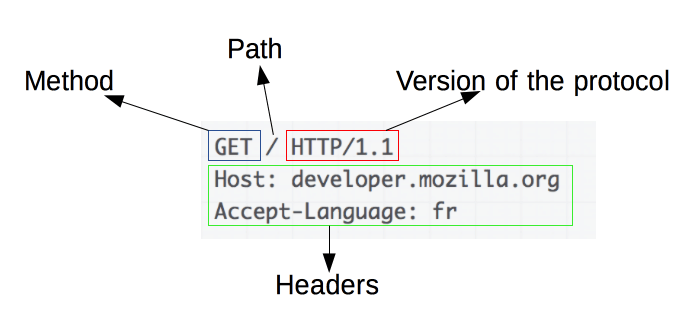
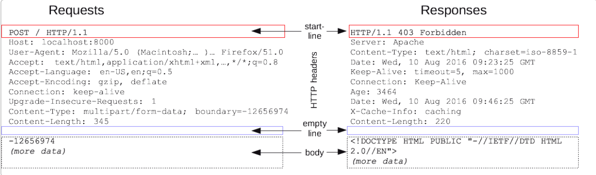

# HTTP 报文
HTTP/1.1 以及更早的 HTTP 协议报文都是语义可读的。在 HTTP/2 中，这些报文被嵌入到了一个新的二进制结构，帧。帧允许实现很多优化，比如报文头部的压缩和复用。即使服务端将原始 HTTP 报文拆分为多个分段，并以 HTTP/2 发送给客户端，客户端会重组原始 HTTP/1.1 请求。因此用 HTTP/1.1 格式来理解 HTTP/2 报文仍旧有效。

有两种 HTTP 报文的类型，请求与响应，每种都有其特定的格式

## 请求

请求由以下元素组成： 
- Method（方法），经常是由一个动词像GET, POST 或者一个名词像OPTIONS，HEAD来定义客户端的动作行为。通常客户端的操作都是获取资源（GET 方法）或者发送HTML form表单（POST 方法），虽然在一些情况下也会有其他操作。
- Path（要获取资源的路径），通常是上下文中元素资源的 URL（去除掉protocol（http://），domain和TCP 的port)。
- HTTP（协议版本号）。
- Headers，为服务端表达其他信息的可选头部 headers。
- body，对于一些像 POST 这样的方法，报文的 body 就包含了发送的资源，这与响应报文的 body 类似。

### Response

响应报文包含了下面的元素： 
- HTTP 协议版本号。 
- 一个状态码（status code），来告知对应请求执行成功或失败，以及失败的原因。 
- 一个状态信息，这个信息是非权威的状态码描述信息，可以由服务端自行设定。 
- HTTP headers，与请求头部类似。 
- body，比起请求报文，响应报文中更常见地包含获取的资源 body。

