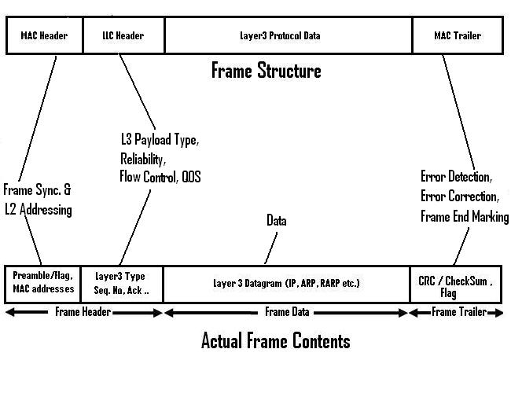

# 数据链路层介绍
数据链路层的工作是以某种方式将物理层的一些位(比特)组织成单元（帧），并且检查每帧是否被正常接收。

## 帧格式

- Flag：表示着一个帧的开始/结束，为比特流划分边界
- MAC地址：表示着一个帧的源MAC地址和目的MAC地址
- ControlAndProtocol：表示着一些控制字段和协议字段（每种帧协议的设计不相同）
- Data：携带着网络层提交的数据
- FCS(Frame check sequence): 循环冗余校验码，是一种错误检测机制，用来验证帧在传输过程中的完整性