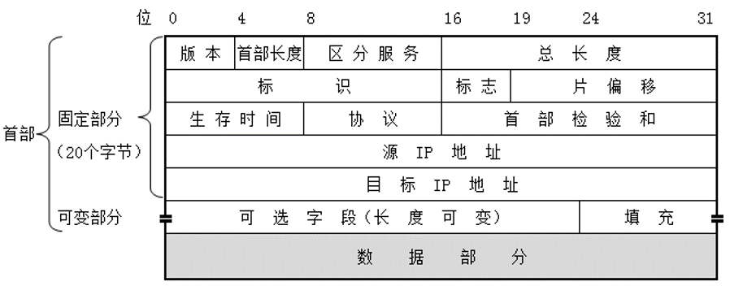
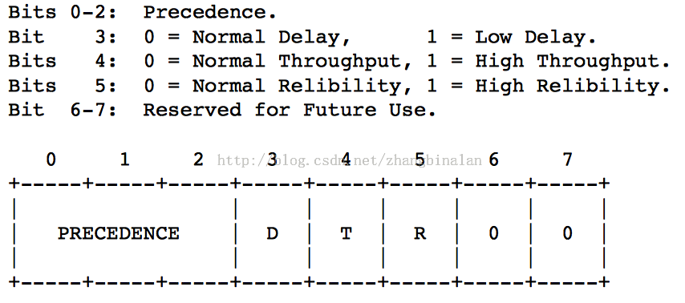

# IP 协议头介绍
IP协议根据源主机和目的主机的地址来传送数据

## 首部

## 字段
#### 版本
IP的版本

#### 首部长度
IP首部长度，最小是20B（不使用任何选项）

#### 区分服务

区分服务包含优先级，时延要求，吞吐量要求，可靠性要求

#### 总长度
首部和数据之和的总长度

#### 标识
一个计数器，每产生一个数据分组就+1。当数据分组的长度超过网络的MTU时，IP数据分组必须分片，此时每个分片数据据分组都拥有同一个标识

#### 标志
有MF和DF两个字段
- MF表示是否还有分片
- DF表示是否可以进行分片

#### 片偏移
表示某片在原分组中的相对位置

#### 生存时间
表示分组在网络中可通过的路由器数的最大值

#### 协议
表示此分组携带的数据使用何种协议

#### 首部校验和
首部校验和只校验分组的首部，而不校验数据部分

#### 源地址和目的地址
标识了这个IP包的起源和目标地址。  
注意除非使用NAT，否则整个传输的过程中，这两个地址不会改变

#### 选项
一般用来告诉路由器执行一些操作，比如当IP包离开每个路由器的时候记录时间

