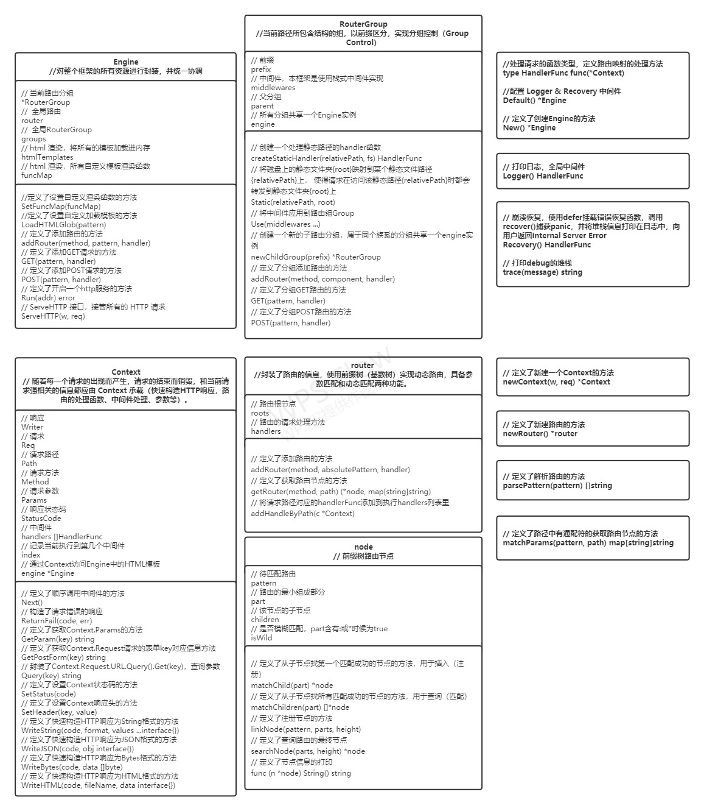

一个基础的**Web框架**组件和功能介绍

|       组件        |                                       功能                                        | 是否必须 |
|:---------------:|:-------------------------------------------------------------------------------:|:----:|
|     server      |                               作为server，监听端口，接受请求                                |  是   |
|     router      |                             路由和分组路由，可以把请求路由到对应的处理函数                             |  是   |
|   middleware    | 支持中间件，对外部发过来的请求经过中间件处理，再给到对应的处理函数。例如http请求的日志记录、请求鉴权（比如校验token）、CORS支持、CSRF校验等。 |  是   |
| template engine |                 模板引擎，支持后端代码对html模板里的内容做渲染（render），返回给前端渲染好的html                 |  否   |
|       ORM       |              对象关系映射，可以把代码里的对象和关系数据库的表、字段做映射关联，通过操作对象来实现数据库的增删改查等操作              |        否        |

## Gin ##
**Gin**是一个golang的HTTP Web微框架，封装优雅，采用一个类似Martini的API，速度出众（高达40倍）。

特点：
- 速度快，性能出众，基于基数树的路由，内存占用小，没有反射，可预测的API性能
- 支持中间件操作，传入的HTTP请求可以由中间件和最终操作处理，如方便编码处理
- 可拓展，支持自定义中间件
- 崩溃恢复，Crash-free，可以捕捉运行期处理http请求过程中的panic，并且做recover操作，让服务一直可用
- JSON验证，Gin可以解析和验证请求的JSON，比如字段必填等
- 错误处理，提供了一种简单的方法可以收集http request处理过程中的错误，最终中间件可以选择把这些错误写入log文件、数据库或者其它系统
- 路由分组，组可以无限嵌套而不会降低性能，可以非常简单地实现路由解析功能，并包含路由组解析功能
- 内置渲染，支持JSNO、XML、和HTML等多种数据格式的渲染，并提供了方便的操作API

### 基数树（压缩前缀树） ###
基数树，即压缩前缀树，是一种更省空间的前缀树。基数树可用来构建关联数组，用于IP路由，信息检索中用于文本文档的倒排索引。

**性质** ：基数树实际是多层哈希映射，解决整形与指针之间的映射关系，当某一层的位置有映射时，才选择扩建一层哈希映射，它可以根据需要开辟空间，而不是直接将空间开辟好。

**优点** ：存储效率高，提高查询效率

**插入** ：在插入一个新节点时，在树中向下查找，若没有相应节点，则生成相应节点，直到比对完，则建立叶节点映射相应的对象。

**删除** ：可以”惰性删除“，即沿着路径查找到叶节点后，直接删除叶节点，中间的非叶节点不删除。

## Gee ##
Golang的`net/http`内置库提供了基础的Web功能（监听端口，映射静态路由，解析HTTP报文），然而Web开发中一些简单的需求`net/http`并不支持，需要手工实现，因此需要框架来简化我们需要频繁手工处理的地方。

一个基础框架的核心能力应该包括：
- 路由（Routing）：将请求映射到函数，支持动态路由
- 模板（Templates）：使用内置模板引擎提供模板渲染机制
- 工具集（Utilites）；提供对cookies，header等处理机制
- 插件（Plugin）：Bottle本身功能优先，但提供了插件机制，可以选择安装到全局，也可以只针对某几个路由生效

**Gee**框架大多参考了**Gin**的设计和源码，为了尽量简洁明了，该框架实现的功能都比较简单，但尽可能地体现一个框架核心的设计规则。
各个模块设计具体如下。

