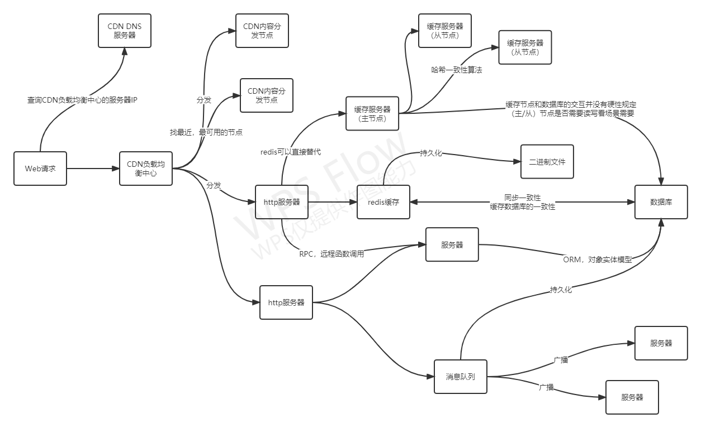

# Current
我们提出一个基于流思想的Web后端架构的框架实现。基于流思想指的是我们把每一个请求视为一条数据流：从用户的浏览器发起的数据流，经过负载均衡进行分发，经过web服务器对请求进行处理，进一步将该请求分发到消息队列，执行数据库等操作。这条数据流衍生的所有操作都属于这条数据流，所有这条数据流引起的操作都可以追踪到原始的数据流。
根据这个思想，我们对web架构的组件进行重构，开发支持流思想的架构组件。

我们由流访问的次序，将web架构大致进行分层。颜色加粗指的是我们计划开发的部分

- 流量分发/转发层
  1. **负载均衡（Load Balance）**：负责请求的分发，决定哪些请求分发到哪个服务器，决定什么请求发送到CDN，什么请求发送到web服务器，决定哪台机器尚且可用等。代表：Nginx。
     1. 开发任务：CurLB（Current Load Balance）
  2. **内容分发网络（Content deliver Network）**：采用缓存服务器，将这些缓存服务器分布到用户访问相对集中的地区或网络中，在用户访问网站时，将用户的访问指向距离最近的工作正常的缓存服务器上，由缓存服务器直接响应用户请求。
     1. 开发任务：CurCDN（Current Content deliver Network）
- 应用逻辑层
  1. **HTTP 协议路由框架（Web Framework）**：CDN处理已知的缓存资源，http web框架则解析和执行请求的逻辑，例如进行条件判断，或者是对某些资源进行修改等等。golang的实现代表：Gin，Beego 等
     1. 开发任务：Current
  2. **远程过程调用（RPC）**：RPC 是指计算机 A 上的进程，调用另外一台计算机 B 上的进程，其中 A 上的调用进程被挂起，而 B 上的被调用进程开始执行，当值返回给 A 时，A 进程继续执行。调用方可以通过使用参数将信息传送给被调用方，而后可以通过传回的结果得到信息。而这一过程，对于开发人员来说是透明的。
     1. 开发任务：CurRPC（Current at RPC）
- 中间件层
  1. **消息队列（Message queue）**：在现代云架构中，应用程序被分解为多个规模较小的独立构建块。消息队列可为这些分布式应用程序提供通信和协调。借助消息队列，各个服务可相互通信并异步执行处理操作。消息队列提供一个临时存储消息的轻量级缓冲区，以及允许服务连接到队列以发送和接收消息的终端节点。这些消息通常较小，可以是请求、恢复、错误消息或明文信息等。要发送消息时，一个名为“生产者”的组件会将消息添加到队列。消息将存储在队列中，直至名为“消费者”的另一组件检索该消息并执行相关操作
     1. 开发任务：CurMQ（current at message queue）
  2. **分布式缓存（distributed cache）**：分布式缓存是一种系统，它将多台联网计算机的随机存取内存 (RAM) 汇集到一个内存数据存储中，用作数据缓存以提供对数据的快速访问。 虽然大多数缓存传统上位于一个物理服务器或硬件组件中，但分布式缓存可以通过将多台计算机链接在一起（称为分布式架构或分布式集群）来超越单台计算机的内存限制，以获得更大的容量和更高的处理能力
     1. 开发任务：CurCache（current at distributed cache）
- 数据表示/存储层
  1. 数据库

